## 📢 Zoom Meetup Event Reminders {.smaller}

::::: columns
::: {.column width="50%"}
 

#### 🎥 Recording Notice

This meetup will be recorded for documentation and learning purposes.

#### 🤝 Inclusive Learning Space

✅ Be respectful and supportive\
✅ Participate and engage in discussions
:::

::: {.column width="50%"}
 

#### 💬 Communication Etiquette

✅ Use chat courteously\
✅ Raise your hand if you want to speak

#### 🚫 Not Allowed

❌ Harassment or offensive comments\
❌ Disruptive behavior
:::
:::::

⭐ Let’s have a fun, engaging, and meaningful learning session!

## The R User Group of Nueva Vizcaya State University ([RNVSU](https://www.meetup.com/r-nvsu/)) {.smaller}

 

🏛 **Sponsors**

-   [R Consortium](https://r-consortium.org)
-   [Nueva Vizcaya State University](https://www.nvsu.edu.ph)

🔭 **Our Vision:** RNVSU as a thriving hub for global collaboration, data science, and open science, driving innovation and sustainable development in the province.

⭐ Join us as we learn, collaborate, and create impact!

## Meet the RNVSU Organizers {.smaller}

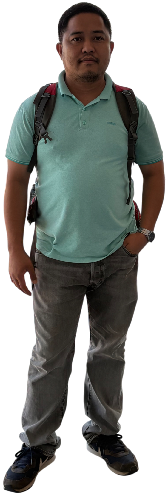{.absolute top="80" left="0" height="60%"}

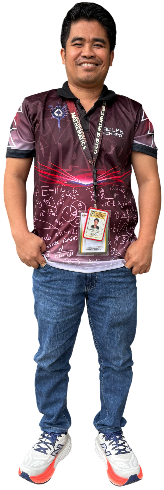{.absolute top="80" left="210" height="60%"}

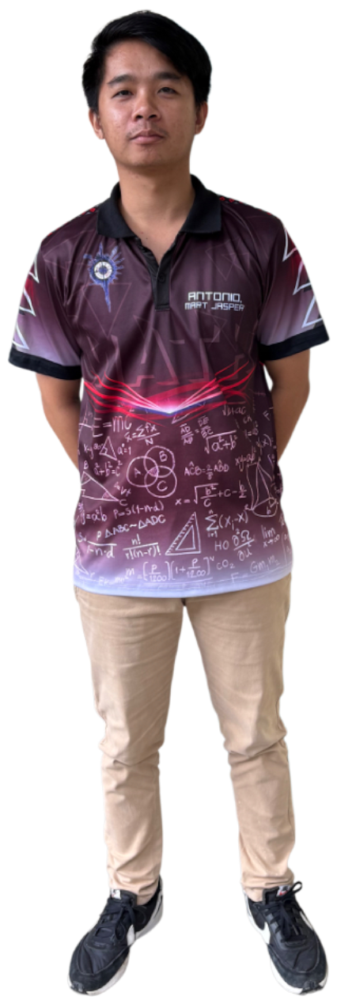{.absolute top="80" left="420" height="60%"}

{.absolute top="80" left="630" height="60%"}

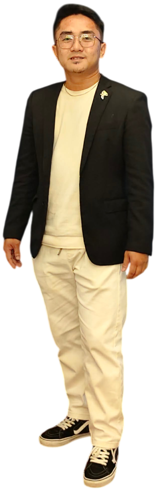{.absolute top="80" left="840" height="60%"}

 
 
 
 
 
 
 
 
 
 
 
 

::: {style="font-size: 70%;"}
Orville D. Hombrebueno [Richard J. Taclay]{style="padding-left: 1em;"} [Mart Jasper G. Antonio]{style="padding-left: 2.5em;"} [Romnick L. Pascua]{style="padding-left: 1.8em;"} [Mer Joseph Q. Caranza]{style="padding-left: 1.8em;"}
:::

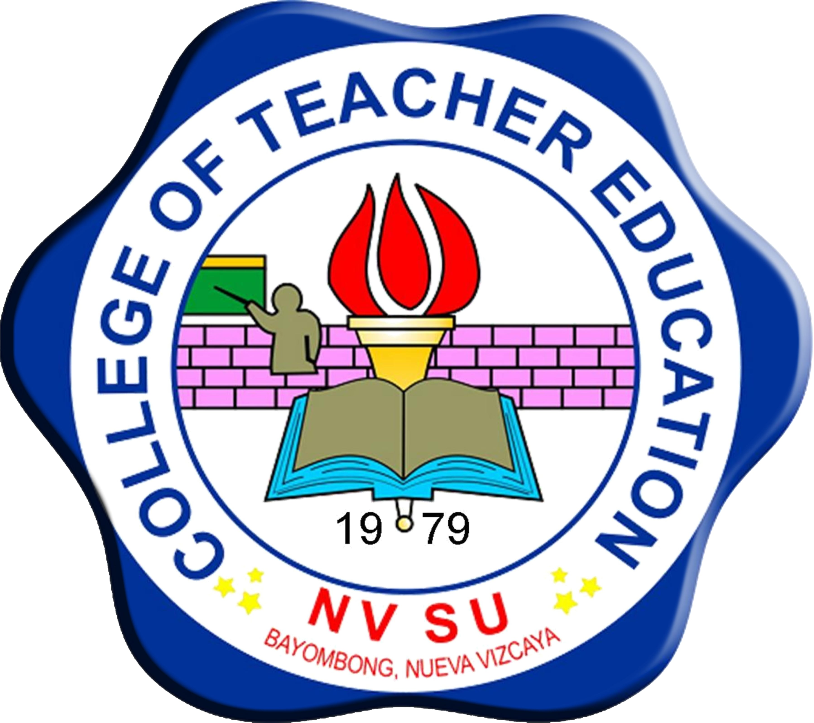{.absolute bottom="30" left="15" height="12%"}

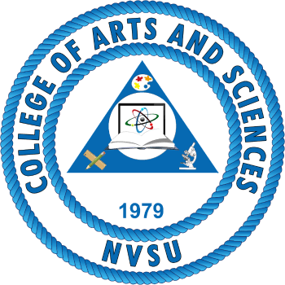{.absolute bottom="30" left="350" height="12%"}

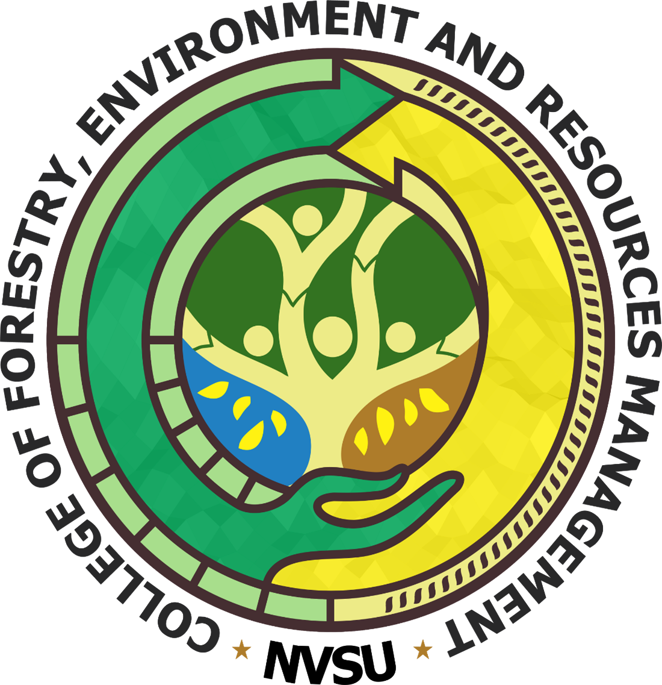{.absolute bottom="30" left="774" height="12%"}

##  Event Organizers

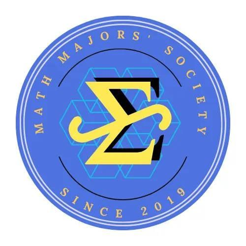{.absolute bottom="250" left="0" height="30%"}

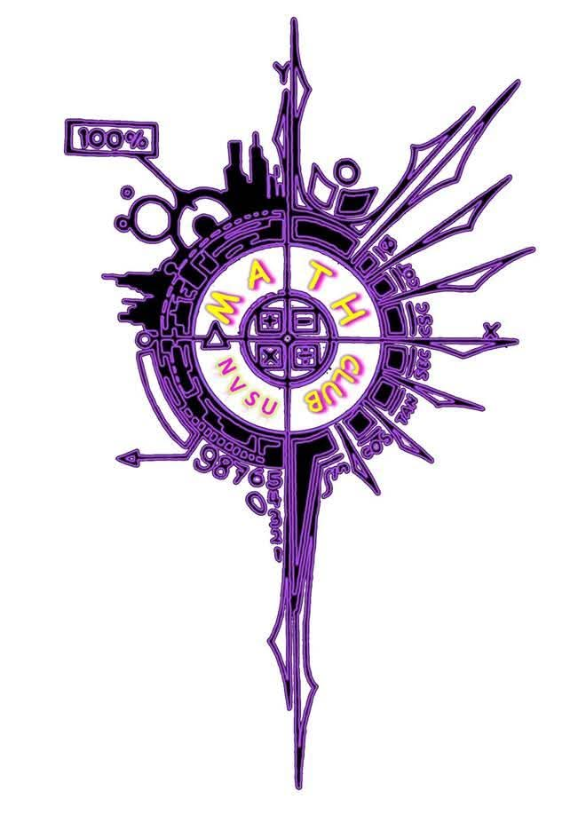{.absolute bottom="250" left="200" height="30%"}

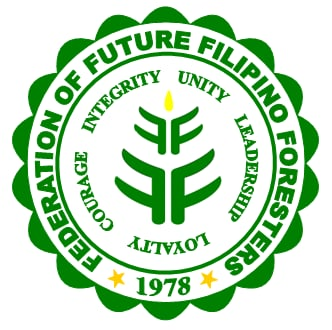{.absolute bottom="250" left="360" height="30%"}

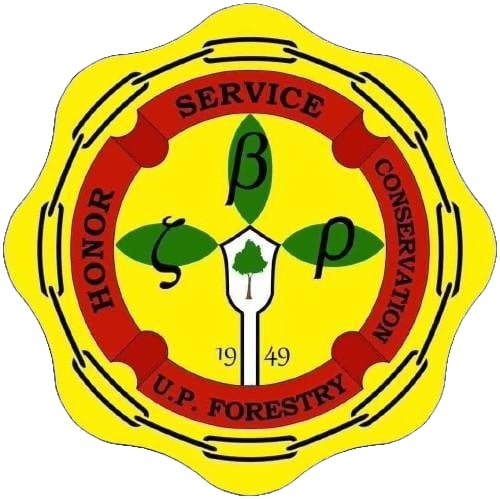{.absolute bottom="250" left="600" height="30%"}

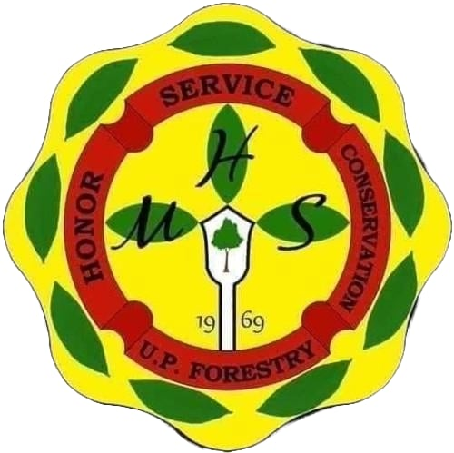{.absolute bottom="250" left="830" height="30%"}

## [](https://www.meetup.com/r-nvsu/) Future Meetup Events {.meetup-heading .smaller}

 

#### March Meetup Events

- 
[Talk 2](https://www.meetup.com/r-nvsu/events/313337627/?eventOrigin=group_upcoming_events):
 [`{tidyplots}`](https://tidyplots.org) for easy data visualization |  [Jan Broder Engler](https://jbengler.de) 

    March 25, 2026 | Wednesday | 7:00-8:30 PM (PHT)
-  [Talk 3](https://www.meetup.com/r-nvsu/events/313596851/):  Introduction to [`{tidymodels}`](https://www.tidymodels.org) |  [Emil Hvitfeldt](https://emilhvitfeldt.com) 

    March 27, 2026 | Friday | 9:30-11:00 PM (PHT)

####  [April Meetup Event](https://www.meetup.com/r-nvsu/events/313601010/) 

- Getting Started with  [Quarto](https://quarto.org):  A Hands-On Workshop |  [Isabella Velásquez](https://ivelasq.rbind.io/about) 

    April 29, 2026 | Wednesday | 9:30-11:00 PM (PHT)
    
## 🎙️Introduction to the Speaker

<iframe data-external="1" src="https://www.kelly-bodwin.com" width="1200" height="500" style="border: 1px solid #ccc" frameborder="0">
</iframe>
